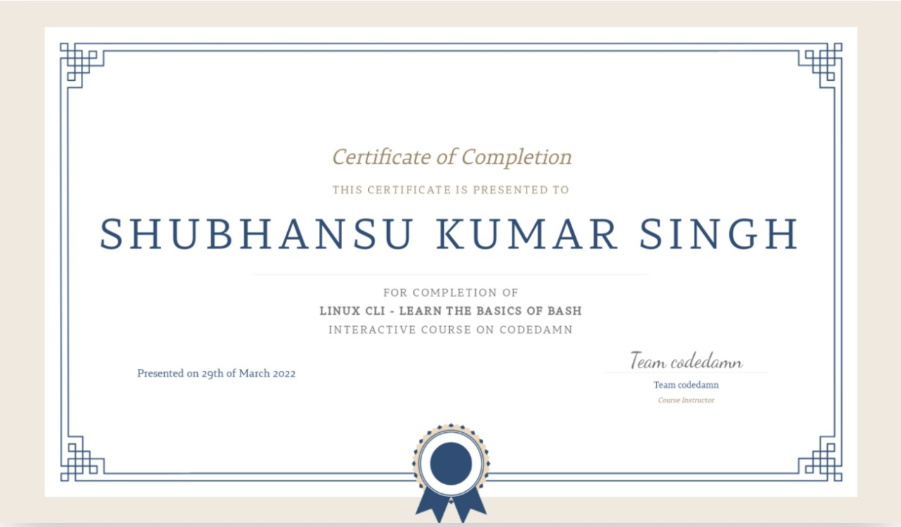

# Learn CLI - Basics of bash

I took the [Codedamn's](https://codedamn.com/) [Linux CLI - Learn the basics of bash](https://codedamn.com/learn/linux-cli-fundamentals)course as a part of Codedamn's [FUll Stack Learning Path](https://codedamn.com/learning-paths/fullstack) to learn the basic linux commands and basics of bash scripting.

This course is for absolute begginers (Not recommended If you know the basics).

Check out my codedamn profile for code certification [@shubhansu](https://codedamn.com/user/shubhansu).

Course [Certificate](./CLI-LInux%20Codedamn.pdf) :    
   

Course duration : 27th March 2022 - 29th March 2022.     
